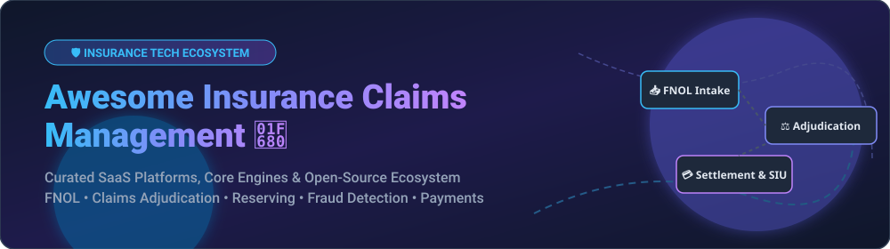

  

  
  
  
  
  
  

---

# 🛡️ Awesome Insurance Claims Management 📊

> **A Curated List of Enterprise SaaS Platforms & Open-Source Projects for Insurance Claims Management**  
> *Covering First Notice of Loss (FNOL), Claims Adjudication, Loss Reserving, Special Investigation Units (SIU), Claims Payments & Automated Claims Lifecycle Systems.*

---

## 📌 Table of Contents

- [🌐 Market Landscape & Industry Overview](#-market-landscape--industry-overview)
- [🏢 SaaS & Enterprise Hosted Platforms](#-saas--enterprise-hosted-platforms)
- [💻 Open-Source GitHub Projects](#-open-source-github-projects)
- [🤝 How to Contribute](#-how-to-contribute)
- [📈 Star History](#-star-history)
- [💬 Support & Community](#-support--community)
- [⚠️ Disclaimer](#%EF%B8%8F-disclaimer)

---

## 🌐 Market Landscape & Industry Overview

The global **Insurance Claims Management Software Market** is estimated at **$6.8 Billion to $10.5 Billion** and is projected to expand to **$15.7+ Billion by 2033** at a Compound Annual Growth Rate (CAGR) of **9.0% – 13.1%**.

> 💡 **Sector Structure:** The market is **moderately concentrated at the enterprise core layer**—where market leaders like Guidewire and Duck Creek dominate tier-1 Property & Casualty (P&C) carriers—but remains **highly fragmented across point solutions** including virtual photo-estimation, AI-powered First Notice of Loss (FNOL) intake, special investigation fraud detection (SIU), and specialized Third-Party Administrator (TPA) workflows.

---

## 🏢 SaaS & Enterprise Hosted Platforms

Below is a comparative breakdown of leading commercial claims management software platforms serving P&C carriers, MGAs, TPAs, and self-insured organizations.

| Product | 🏢 Company Size / Valuation / Revenue | 💰 Starting Pricing Tier | 🎁 Free Tier Limit / Trial | 🚀 Key Capabilities & Focus |
| :--- | :--- | :--- | :--- | :--- |
| **[Guidewire ClaimCenter](https://www.guidewire.com/)** | **Market Cap ~$12.3B** `Annual Rev ~$1.48B` | **Enterprise Custom Contract** *(Starts at ~$1.5M – $4M+/yr based on premium volume)* | **No free tier** *(30-day proof-of-concept sandbox upon carrier request)* | Industry-standard core P&C claims platform, advanced reserving, deep policy integration & rules engines. |
| **[Duck Creek Claims](https://www.duckcreek.com/)** | **Acquired for $2.6B** *(Vista Equity)* `Annual Rev ~$300M+` | **Enterprise Subscription** *(Starts at ~$500,000/yr for cloud tier)* | **No free tier** *(Guided live product demo upon carrier inquiry)* | Low-code SaaS claims platform emphasizing cloud agility, policy binding & automated adjudication. |
| **[Sapiens ClaimsPro](https://www.sapiens.com/)** | **Market Cap ~$1.8B** `Annual Rev ~$520M` | **Enterprise License** *(Starts at ~$250,000 – $500,000/yr)* | **No free tier** *(Tailored interactive sandbox environment for carriers)* | Multi-line global P&C & life/pensions claims management suite with regulatory compliance engines. |
| **[Origami Risk Claims](https://www.origamirisk.com/)** | **Valuation ~$1.5B+** `Annual Rev ~$200M+` | **Custom SaaS Subscription** *(Starts at ~$50,000/yr for TPAs / mid-market)* | **No free tier** *(14-day guided proof-of-concept environment upon request)* | Integrated risk management (RMIS), self-insured core, claims tracking & incident intake. |
| **[Insurity Claims](https://www.insurity.com/)** | **Valuation ~$1.2B+** `Annual Rev ~$150M+` | **Enterprise Annual License** *(Starts at ~$100,000/yr per line of business)* | **No free tier** *(Scheduled carrier demo & technical evaluation sandbox)* | P&C core claims platform, cloud infrastructure & predictive analytics for commercial lines. |
| **[Majesco Claims](https://www.majesco.com/)** | **Valuation ~$1.0B+** `Annual Rev ~$160M+` | **SaaS Subscription** *(Starts at ~$150,000/yr for claims cloud module)* | **No free tier** *(Custom demo & architecture discovery session)* | Cloud-native insurance suite providing digital claim intake, adjuster portals & workflow management. |
| **[OneShield Claims](https://www.oneshield.com/)** | **Valuation ~$300M+** `Annual Rev ~$60M+` | **SaaS Licensing** *(Starts at ~$75,000/yr for mid-market carriers)* | **No free tier** *(Personalized demo & trial sandbox for insurance teams)* | Configurable core claims & policy processing tailored for mid-market P&C insurers and MGAs. |
| **[Snapsheet](https://www.snapsheet.com/)** | **Valuation ~$150M+** `Annual Rev ~$300M+` | **Pay-per-Claim + Base SaaS** *(Starts at ~$25/claim + $1,000/mo base)* | **No free tier** *(30-day pilot program for carrier virtual appraisal evaluation)* | Digital claims platform specializing in virtual estimation, photo-based claims & fast payments. |
| **[Claimable](https://www.claimable.com/)** | **Valuation ~$10M** `Annual Rev ~$2M – $5M` | **$79 / user / month** *(Startup Plan; Growth Plan at $129/user/mo)* | **14-day free trial** *(Full feature access + priority onboarding support)* | Modern cloud claims management software for small insurers, MGAs, TPAs, and claims adjusters. |
| **[CCS ClaimSuite](https://www.example.com/)** | **Valuation ~$5M** `Annual Rev ~$1M – $3M` | **$499 / month** *(Modular base tier up to 5 adjusters)* | **30-day free trial** *(Available for qualifying TPAs & independent adjusters)* | Niche claims management suite serving specialized independent claims adjusters and regional TPAs. |

---

## 💻 Open-Source GitHub Projects

Full-featured commercial core claims systems are proprietary; however, high-quality open-source components exist for case management, AI FNOL voice agents, actuarial loss reserving, machine learning risk modeling, and fraud detection.

The repositories below are sorted by **GitHub Star Count** (descending):

- **[frappe / erpnext](https://github.com/frappe/erpnext)**   
  *Comprehensive open-source ERP system featuring modular case management, task tracking pipelines, document repositories, and general ledger accounting applicable to claims management.*

- **[Shubhamsaboo / awesome-llm-apps](https://github.com/Shubhamsaboo/awesome-llm-apps)**   
  *Features an open-source "Insurance Claim Live Agent Team" demonstrating voice-based FNOL intake and automated claim adjudication using multi-agent LLM systems.*

- **[casact / chainladder-python](https://github.com/casact/chainladder-python)**   
  *Official Casualty Actuarial Society (CAS) open-source Python package for loss reserving, Mack ChainLadder modeling, triangle data manipulation, and IBNR calculations.*

- **[daxaxelrod / open_insure](https://github.com/daxaxelrod/open_insure)**   
  *Open-source policy management and claims tracking platform designed for mutual insurance models, self-insurance groups, and community claim evidence workflows.*

- **[MindSetLib / Insolver](https://github.com/MindSetLib/Insolver)**   
  *Low-code machine learning Python library tailored for insurance analytics, claim frequency/severity modeling, loss ratio prediction, and production deployment.*

- **[83898487 / Car.ly - Vehicle Insurance Claim Fraud Detection](https://github.com/83898487/Car.ly---Vehicle-Insurance-Claim-Fraud-Detection)**   
  *Machine learning classification repository (XGBoost, Random Forest) built specifically for detecting fraudulent patterns in auto insurance claim submissions.*

- **[nirab25 / Insurance-Claim-Fraud-Detection](https://github.com/nirab25/Insurance-Claim-Fraud-Detection)**   
  *End-to-end data analytics and ML workflow for identifying suspicious claim behaviors and automated anomaly flag generation.*

- **[Giulioc92 / OneYearCorrelatedChainLadder](https://github.com/Giulioc92/OneYearCorrelatedChainLadder)**   
  *Actuarial reserving package implementing one-year correlated loss reserving methods across multiple insurance lines.*

---

## 🤝 How to Contribute

Contributions are welcome! To suggest a new SaaS solution or open-source repository:

1. 🍴 **Fork** this repository.
2. 📝 **Edit** `README.md` to add your item (please maintain table & star badge formatting).
3. 🔍 Ensure descriptions are **factual** and include starting pricing / star count links.
4. 🚀 Open a **Pull Request (PR)** with a summary of changes.

---

## 📈 Star History

---

## 💬 Support & Community

Thank you for visiting **Awesome Insurance Claims Management**! If this repository has been helpful for your InsurTech research or software evaluation:

- ⭐ **Star this repository** to help others in the insurance industry find it!
- 🔀 **Fork & Share** with your colleagues, software engineers, and claims leaders.
- ☕ **Support the maintainer**: Show your appreciation on our [GitHub Sponsors Dashboard](https://github.com/sponsors/ishandutta2007).

---

## ⚠️ Disclaimer

- This list is **community-curated** for informational purposes only.
- Insurance claims processing involves sensitive personally identifiable information (PII), medical data (HIPAA), and strict financial regulations. Any production claims system must undergo thorough security, audit trail, and regulatory compliance validation.
- This repository does not constitute legal, actuarial, compliance, or financial advice.

---

  <i>Built for claims leaders, InsurTech developers, and TPAs modernizing the claims lifecycle.</i>

